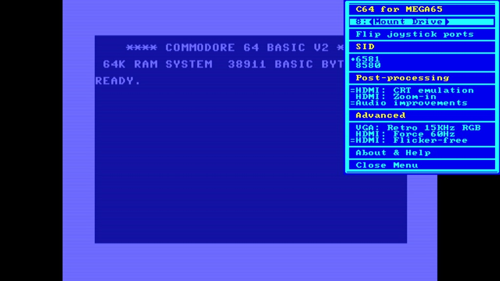
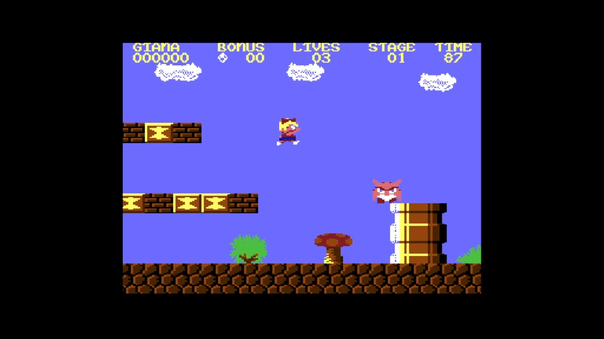
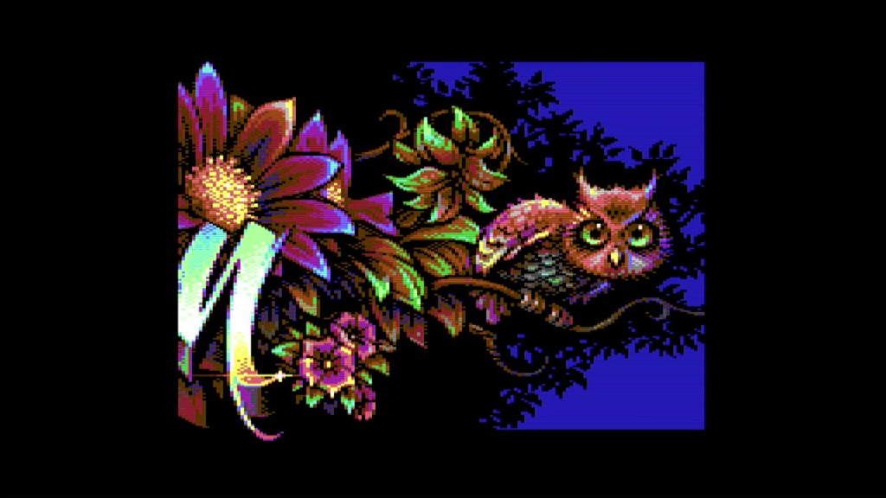
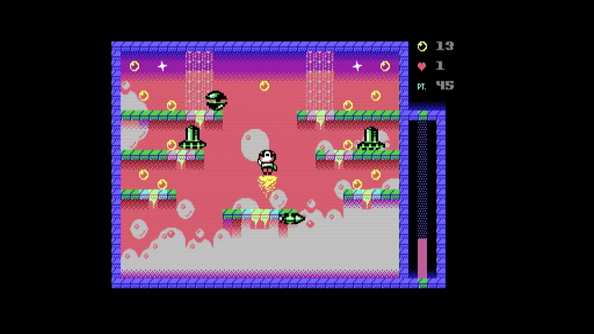
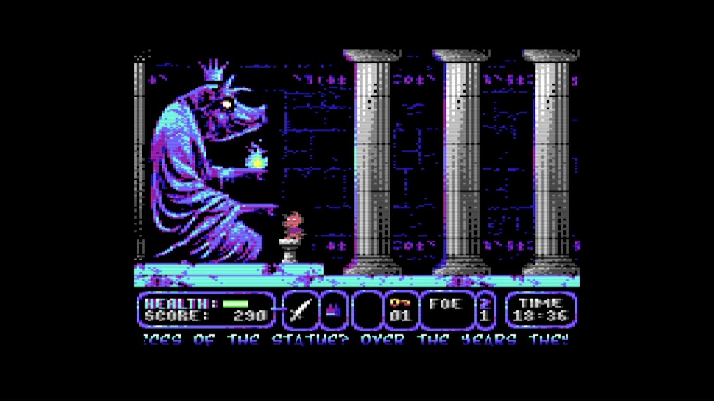

Commodore 64 for MEGA65
=======================

Experience the [Commodore 64](https://en.wikipedia.org/wiki/Commodore_64) with
great accuracy and sublime compatibility on your
[MEGA65](https://mega65.org/)! If you are in a hurry or have issues,
go to the
[FAQ - Frequently Asked Questions](FAQ.md). If you are a
[developer](doc/developer.md)
and want to build the C64 core by yourself then head to our
[developer documentation](doc/developer.md).
Otherwise, scroll down and read the user's manual.

This core is based on the
[MiSTer](https://github.com/MiSTer-devel/C64_MiSTer) Commodore 64 core which
itself is based on the work of [many others](AUTHORS).

[MJoergen](https://github.com/MJoergen) and
[sy2002](http://www.sy2002.de) ported the core to the MEGA65 in 2022 and 2023.

The core uses the [MiSTer2MEGA65](https://github.com/sy2002/MiSTer2MEGA65)
framework and [QNICE-FPGA](https://github.com/sy2002/QNICE-FPGA) for
FAT32 support (loading ROMs, mounting disks) and for the
on-screen-menu.

Features
--------

With our [Release 5](VERSIONS.md), we are striving for a **retro C64 PAL
experience**: The core turns your MEGA65 into a Commodore 64 with a C1541
drive (you can mount `*.d64`) images. It supports the following hardware
ports of the MEGA65:

* Joystick port for joysticks, mice and paddles
* Expansion port for C64 cartridges: Games, freezers, fast loader
  cartridges, GeoRAM, multi-function flash cartridges, etc.
* IEC port so that you can attach real 1541 & 1581 drives as well as
  printers, plotters or modern devices such as the SD2IEC and the
  Ultimate-II+

Additionally, the C64 for MEGA65 core can simulate a 1750 REU with 512KB
of RAM, it can simulate cartridges (by loading `*.crt` files) and it offers
a Dual SID / Stereo SID experience.

The C64 runs the original Commodore KERNAL and the C1541 runs the original
Commodore DOS, which leads to authentic loading speeds. You will be surprised,
how slowly the C64/C1541 were loading... :-) You can optionally
[install JiffyDOS](doc/jiffy.md)
or use fast loader cartridges to speed up loading.

And you will be amazed by the 99.9% compatibility that this core has when it
comes to games, demos and other demanding C64 software. Some demos are even
recognizing this core as genuine C64 hardware. And even things like using
a fast loader cartridge while connecting a genuine 1541 via IEC are working
flawlessly.

### Video and Audio

Our philosophy on the MEGA65's outputs is that VGA is the "pure" retro-output
(and you can also switch it to 15 kHz and composite sync for a true retro
feeling) while HDMI is the "processed" modern output. So there is no
"processing" such as CRT emulation and other things on the VGA output, while
on the HDMI output several algorithms are working for a very nice looking
authentic image.

* HDMI: The core outputs 1280×720 pixels (720p) at 50 Hz and HDMI audio at
  a sampling rate of 48 kHz by default. This is supported by a vast majority
  of monitors and TVs. The 4:3 aspect ratio of the C64's output is preserved
  during upscaling, so that even though 720p is a 16:9 picture, the C64 looks
  pixel perfect and authentic on HDMI.

  If you use a 4:3 or 5:4 display via HDMI then use the option "HDMI: 4:3
  50 Hz" or "HDMI: 5:4 50 Hz" respectively to activate "PAL over HDMI";
  the core will output 720x576 pixels (576p) at 50 Hz.

  In case of compatibility problems, please try the different solutions in the
  section [HDMI compatibility](#hdmi-compatibility) below.

* VGA: For a true retro feeling, we are providing a 4:3 image via the
  MEGA65's VGA port, so that you can connect real CRT monitors or older
  4:3 LCD/TFT displays. The resolution is 720x576 pixels and the frequency
  is 50.125 Hz in PAL mode. If your monitor supports this, you will
  experience silky smooth scrolling without any flickering and tearing.

* Retro 15 kHz RGB over VGA: This is for the ultimate retro experience:
  Connect an old SCART TV or an old RGB-capable monitor to MEGA65's VGA port.
  The core supports composite sync (CSYNC) so that SCART and other retro
  devices work flawlessly. Learn more in the dedicated documentation
  about [using analog retro cathode ray tubes](doc/retrotubes.md).
  
Important: If you use VGA displays or analog retro monitors, please switch off
"HDMI: Flicker-free" as described
[here](#important-advice-for-users-of-analog-vga-and-retro-15-khz-rgb-over-vga).

### Convenience

* On-Screen-Menu via the MEGA65's <kbd>Help</kbd> key to mount `*.d64` 
  disk images, load and run `*.crt` cartridges, directly run `*.prg`
  programs and to configure the core
* Realtime switching between 6581/8580 mono SID and several stereo SID
  options
* Realtime switching between 6526 CIA and 8521 CIA
* CRT filter: Optional visual scan lines via HDMI so that the output looks
  more like an old monitor or TV including authentic anti-aliasing
* Crop/Zoom: On HDMI, you can optionally crop the top and bottom border of
  the C64's output and zoom in, so that the 16:9 screen real-estate is
  better utilized and you have a larger picture. Great for games.
* Audio processing: Optionally improve the raw audio output of the system
* Scale-down the OSM to accomodate the overscan of some analog retro
  cathode ray tubes

### Constraints and Roadmap

Our Release 5 is a mature release. Thanks to all the folks who
[contributed](AUTHORS) to the core, it is incredibly compatible to an original
Commodore 64. With our Release 5 you can play nearly all the available games
and watch almost all demos ever written for the C64. You can plug nearly
every hardware cartridge ever made for the C64 into the MEGA65's expansion
port and enjoy working/playing with it and you can work with any IEC device
(retro devices such as original 1541 or 1581 drives, printers, plotters
and modern devices such as the SD2IEC and the Ultimate-II+). It happens more
often than not, that the core is recognized as real hardware by software.

Yet, at this moment, our MEGA65 version of the MiSTer core is still lacking
some nice features such as:

* Use the MEGA65's physical drive as a C1581
* NTSC mode
* Mounting tapes (`*.tap`)
* Supporting D81 disk images (`*.d81`)
* Supporting G64 disk images (`*.g64`)
* Formatting disk images (`*.d64` and `*.g64`)
* Supporting MiSTer's GCR-level disk manipulation

And there is much more. Have a look at our [Roadmap](ROADMAP.md)
to learn what we plan to do in future.

Since we do this as a hobby, it might take a year or longer until these
things are supported. So please bear with us or [help us](CONTRIBUTING.md).

Some demo pictures
------------------

|     |    |  | 
|:-----------------------------------------:|:----------------------------------------:|:--------------------------------------:| 
| *Core Menu*                               | *Disk mounting / file browser*           | *Giana Sisters*                        |
|     |    |  | 
| *Censor Design & Oxyron: Comaland*        | *Robot Jet Action*                       | *A Pig Quest*                          |

Clarification: These screenshots are just for illustration purposes.
This repository does not contain any copyrighted material.

Installation
------------

Make sure that you have a MEGA65 R3, R3A or newer. At the moment, we are not
supporting older R2 machines. If you are not sure what MEGA65 version you have
then you very probably have an R3, R3A or newer: The Devkits are R3 and the
machines from Trenz are R3A.

1. [Download](https://github.com/MJoergen/C64MEGA65/releases/download/V5/C64MEGA65-V5.zip)
   the ZIP file that contains the bitstream and the core file and unpack it.
2. Copy the `.cor` file on an SD card that has been formatted using the
   MEGA65's built-in formatting tool. If you want to be on the safe side, just
   use the internal SD card (bottom tray), which is formatted like this
   by default.
3. Read the section "How do I install an alternative MEGA65 core?" on the
   [alternative MEGA65 cores](https://sy2002.github.io/m65cores/index.html)
   website or read the section "Bitstream Utility" in the
   [MEGA65 Starter Guide](https://files.mega65.org/news/MEGA65-Starter-Guide.pdf).
4. The core supports FAT32 formatted SD cards to mount `.D64` disk images
   for the C1541 at drive 8.
5. If you put your disk images into a folder called `/c64`, then the core will
   display this folder on startup. Otherwise the root folder will be shown.
   If you want the core to remember the settings, make sure you read the
   section [Config file](#config-file) below.
6. Press the <kbd>Help</kbd> key on your MEGA65 keyboard as soon as the core
   is running to mount disks and to configure the core.
   
### Config file

If you want the core to remember the settings you made in the on-screen-menu,
then make sure that you copy the
[config file](https://github.com/MJoergen/C64MEGA65/raw/V4/bin/Version%204/R3/c64mega65)
into a folder called `/c64`. This `/c64` folder needs to be located in the
root folder of the SD card that is active when you boot the core. The config
file is called `c64mega65` and is located in the ZIP file that you downloaded
from the
[MEGA 65 filehost](https://files.mega65.org?id=896a012f-59e4-456c-b91f-7e989b958241).

The very first time you start the core after you copied the `c64mega65` config
file into the `/c64` folder, it will detect the new config file and present
you with factory default settings when you press <kbd>Help</kbd> to open the
on-screen-menu. After that, the core will always save the settings when you
close the on-screen-menu and remember them when you restart the core at a
later time.

Important: If you change the SD card, for example by using <kbd>F1</kbd> or
<kbd>F3</kbd> in the file browser or by physically changing or removing the
card that contains your `/c64/c64mega65` config file, then the core will not
remember your newest on-screen-menu settings upon next start.

### Important advice for users of analog VGA and retro 15 kHz RGB over VGA

It is highly recommended to switch off "HDMI: Flicker-free" when using
analog VGA monitors or monitors that work with the "retro 15 kHZ RGB
over VGA" signal.

Otherwise you might encounter strange visual effects that range from
a blurry image over "underwater" blurry movement of your screen to sporadic
flickers and sometimes to a complete loss of VGA sync every few seconds or
minutes.

[Learn more](#flicker-free-hdmi) about "HDMI: Flicker-free" to understand
why this is happens.

### Using `.bit` files instead of `.cor` files

If you are a developer and/or have a JTAG adaptor connected to your MEGA65,
then you can use the `.bit` file from the ZIP instead of the `.cor` file:
Run the [M65 tool](https://github.com/MEGA65/mega65-tools) using this
syntax `m65 -q yourbitstream.bit` and the core will be immediately loaded
into the FPGA of the MEGA65 and automatically started.

Using `.bit` files is very useful, in case you want to try out multiple cores
or core versions quickly without going through the lengthy process of
flashing `.cor` files.

HDMI compatibility
------------------

Right now, the C64 core is not compatible with all HDMI displays. If your
display works with the MEGA65 core but stays black when you load the C64 core,
then try this (while the display is black):

1. Boot the C64 core and wait a few seconds.
2. Press the <kbd>Help</kbd> key.
3. Press six times (6x) the <kbd>Up</kbd> cursor key.
4. Press <kbd>Return</kbd>.
5. Press five times (5x) the <kbd>Down</kbd> cursor key.
6. Press <kbd>Return</kbd>.
7. Wait a few seconds.
8. If this does not solve the issue, continue:
9. Press four more times (4x) the <kbd>Up</kbd> cursor key.
10. Press <kbd>Return</kbd>.
11. Wait a few seconds.
12. If this does not solve the issue, continue:
13. Press one time (1x) the <kbd>Down</kbd> cursor key.
14. Press <kbd>Return</kbd>.

### Explanation: DVI mode, 60 Hz mode, 576p

The recipe above first activates the "DVI mode" as you are choosing the
menu item "HDMI: DVI (no sound)" in the on-screen-menu when you press the
<kbd>Return</kbd> key for the first time.

In DVI mode, the HDMI data stream sent by the core to your display has a
slightly different format and it does not contain any sound. You need to use
the 3.5mm audio-out in this case.

When you press <kbd>Return</kbd> for the second time, the 60 Hz mode is
activated, independent of the C64's output, which is still 50 Hz in PAL mode.
This works fine in general, but leads to some flickering and jerky scrolling
here and there.

The third press of <kbd>Return</kbd> switches from 720p to 576p.

Working with the file browser
-----------------------------

Thanks to long filename support and alphabetically sorted file- and directory
listings, using the file browser is straightforward. Press MEGA65's
<kbd>Help</kbd> key to open the on-screen-menu while the C64 is running
and either select `8:<Mount Drive>`, `PRG:<Load>` or `CRT:<Load>` using the
cursor keys and <kbd>Return</kbd>. Here is how the browser works:

* Navigate up/down using the <kbd>Cursor up</kbd> and
  <kbd>Cursor down</kbd> keys
* Page up and page down using the <kbd>Cursor left</kbd> and
  <kbd>Cursor right</kbd> keys
* <kbd>Return</kbd> mounts a disk image (`*.d64`), loads a program file
  (`*.prg`) or load cartridge image (`*.crt`)
* <kbd>Run/Stop</kbd> exits the file browser without mounting/loading
* Remembers the browsing history, i.e. even while you climb directory trees,
  when you mount the next image, the file selection cursor is positioned where
  you left off. This is very convenient for mounting multiple subsequent
  disks of a demo in a row.
* Support for both SD card slots: The back slot has precedence over the bottom
  slot: As soon as you insert a card to the back slot, this card is being
  used. SD card changes are detected in real-time; also while the
  file browser is open.
* Within the file browser you can use <kbd>F1</kbd> to manually select
  the internal SD card (bottom tray) and <kbd>F3</kbd> to select the
  external SD card (back slot).
* The file browser defaults to the folder `/c64` in case this folder exists.
  Otherwise it starts at the root folder.
* The file browser only shows files with a valid file extension for the
  mode it is currently in: Mounting disk images (`*.d64`), loading programs
  (`*.prg`) or loading cartridges (`*.crt`).

Working with disk images
------------------------

### Mounting disk images

Currently, we support D64 disk images with 35 or 40 tracks (standard format,
no error bytes). This covers 99% of all use cases. We do have support for
additional D64 disk image variants and G64 disk images on our
[Roadmap](ROADMAP.md).

Select `8:<Mount Drive>` and use the file browser as described above to
mount a disk image. Enter `LOAD "$",8` and then `LIST` to list the contents
of the disk image or enter `LOAD "*",8,1` and then `RUN` to load and start
most games.

### Switching diskettes while a program is running

Sometimes a game, demo or application asks you to turn the disk (disks often
had two sides back in the days) or to insert another disk.

To do this, open the menu using the <kbd>Help</kbd> key and select
`8:<name-of-your-disk-image>` using the <kbd>Return</kbd> key. Now browse and
select the new diskimage and confirm again with <kbd>Return</kbd>. This will
change this disk image while leaving the drive itself on and active and
for the C64 core this looks like switching a diskette.

### Unmounting disk images

An already mounted drive can be unmounted (i.e. "switch the drive off"):
Select it in the <kbd>Help</kbd> menu using the <kbd>Space</kbd> bar. Do
not unmount your disk image, if a program asks you to turn the disk or to
insert another disk.

### Writing to disk images

The C64 core supports not only reading from D64 disk images but also writing
to them (and to the MEGA65's SD cards) so that you can save your gaming
high-scores and play games that are able to save and restore the game's state.
And you can now work productively with the C64 core on the MEGA65 for example
by saving documents in GEOS or by saving your BASIC programs.

Important things to know about how writing to disk images works:

* While the C64 is saving something, the drive led is green.
* In case of an error, the led is blinking green.
* When the C64 successfully saved something then it was only written to
  an internal buffer; it is not yet written to the SD card. This is why you
  will see the drive led quickly turn from green to yellow after the C64 is
  done with saving. This is the process of actually saving all the
  changes to the SD card. It happens seamlessly in the background, you do not
  need to do anything specific.
* To prevent data corruption after saving something: Never turn the MEGA65 off
  or remove the SD card while the led is green or before the drive led turned
  yellow and went off afterwards.
* Sometimes the C64 saves things "in chunks" / "in batches", so that it might
  happen that you see the drive led being green, then yellow, then off and
  then green/yellow/off for a second or third time. Always give the system
  the time to settle before you turn it off or reset it or remove the
  SD card.
* If you did not save anything, then the drive led will not turn yellow.

Directly loading `*.prg` files
------------------------------

A lot of games, demos and also SID tunes are available as "one-file" releases
in the `*.prg` file format. You do not need to create a `*.d64` disk image
and add the programs to the disk image. Instead, you can directly copy them
on your SD card and run them using the `PRG:<Load>` menu item.

IMPORTANT: Make sure that either one of the three following things is true:

* You have no hardware cartridge inserted into the MEGA65's Expansion Port and
  have selected `Use hardware slot` in the `Expansion Port` menu.

* You have no `*.crt` file loaded and have selected `Simulate cartridge` in
  the `Expansion Port` menu.

* You have selected `Simulate 1750 REU 512KB` in the `Expansion Port`
  menu.

The reason for this is: Before the core attempts to load a program into the
C64's memory, it resets the core. This is for your convenience so that you
can load multiple programs in a row. But since cartridges are also started via
a reset of the core, the three options above make sure that no cartridge is
active.

SID configuration / Dual SID / Stereo SID
-----------------------------------------

### 6581 vs. 8580

The original Commodore 64 "only" had one SID. Older versions had a SID
called `6581` and newer versions had a SID called `8580`. Both were mono,
there was no stereo capability available. This is why by default, the C64
for MEGA65 core starts with only one SID enabled, the `6581`.

If you are an audiophile when it comes to SID music, then you always might
want to choose the right SID for the game or demo or music release that you
are running. The C64 core lets you select different SID versions and
configurations in real-time while the program is running. As a rule of thumb
you can assume that most games and demos since the year 2000 optimized their
music and sound effects for the `8580` and most older games and demos were
optimized for the `6581`. Beware that this is a rule of thumb and many
exceptions exist.

### Pseudo stereo using a mixed dual SID setup

A dual SID setup utilizing a 6581 on the left stereo channel and an 8580 on
the right channel (or vice-versa) creates a pleasant pseudo stereo effect for
the C64 because each SID chip has its own unique tonal characteristics,
producing a richer and more dynamic audio experience. This combination allows
for a wider soundstage, resulting in an immersive listening experience that
enhances the enjoyment of the classic C64 gaming and music content.

To setup this mixed dual SID configuration - which is still mono - go to the
SID menu and select either `L: 6581 R: 8580` or `L: 8580 R: 6581` while
**in parallel** selecting `Same as left SID port` in the `Right SID Port`
section.

### Stereo SID

True stereo SID is not widely supported on the C64. A few modern games (such
as
[Super Mario Bros 64 by ZeroPaige](https://csdb.dk/release/?id=185677)),
[some demos](https://csdb.dk/search/advancedresult.php?form%5Bcategory%5D=releases&showprpage=25&form%5Bgroup_fday1%5D=1&form%5Bgroup_fmonth1%5D=1&form%5Bgroup_fyear1%5D=1982&form%5Bgroup_fday2%5D=1&form%5Bgroup_fmonth2%5D=1&form%5Bgroup_fyear2%5D=2024&form%5Bgroup_rating_c%5D=1&form%5Bgroup_rating%5D=1&form%5Bscener_rating_c%5D=1&form%5Brelease_rday1%5D=1&form%5Brelease_rmonth1%5D=1&form%5Brelease_ryear1%5D=1982&form%5Brelease_rday2%5D=1&form%5Brelease_rmonth2%5D=1&form%5Brelease_ryear2%5D=2024&form%5Brelease_rating_c%5D=1&form%5Brelease_rating%5D=1&form%5Bevent_hday1%5D=1&form%5Bevent_hmonth1%5D=1&form%5Bevent_hyear1%5D=1982&form%5Bevent_hday2%5D=1&form%5Bevent_hmonth2%5D=1&form%5Bevent_hyear2%5D=2024&rcompo_type%5B%5D=20&showprpage=25&first=0)
and some music disks and specialized releases
(such as the awesome
[Game of Thrones by Genesis Project](https://csdb.dk/release/?id=157533))
support true stereo using two SIDs. You can also browse the
[High Voltage SID collection](https://www.hvsc.c64.org/)
for stereo SID releases.

IMPORTANT: Always configure one of the options under `Stereo SID` and
additionally the correct `Right SID Port` in the SID menu to enjoy stereo SID
music. What the "correct" port is depends on the software that you are
running. If you are not sure, try `D420` first. 

512 KB RAM Expansion Unit (1750 REU)
------------------------------------

Select `Simulate 1750 REU 512KB` in the `Expansion Port` menu.
The 1750 512KB REU is as close to cycle accurate as it can go on a MEGA65.
Remember, we are pretty constrained by the quirky HyperRAM. This means our REU
is not perfect, but 99.9% perfect: It even runs the very picky
[TreuLove_ForReal1750Reu.d64](http://csdb.dk/getinternalfile.php/144854/TreuLove_ForReal1750Reu.d64)
version of Booze Design's Treu Love demo
([see CSDB page](https://csdb.dk/release/?id=144105))
that is supposed to only run on real hardware and also the absolutely
awesome game
[Sonic the Hedgehog](https://csdb.dk/release/?id=212523)
runs like a charme on the MEGA65.

Please feel free to browse
[CSDB's REU Releases](https://csdb.dk/search/advancedresult.php?form%5Bcategory%5D=releases&rrelease_type%5B%5D=6)
and enjoy them on your MEGA65.

The REU also works perfectly with GEOS: Configure a RAM drive, copy the
programs, fonts and file you want to work with on the RAM drive and enjoy a
10x acceleration of your GEOS workflows. Don't forget to copy the results
of your work on a "real disk" (D64 data disk that you have mounted) before
ending your GEOS session so that all your data is persistently saved to the
MEGA65's SD card (see also the section
["Writing to disk images"](#writing-to-disk-images)
above).

The REU is switched off by default. You can switch it on using the options
menu.

Compatibility advise: **Only turn on the REU for software that is
explicitly supporting the REU.** Otherwise you might experience random
crashes of otherwise very stable software. Explanation: The REU itself is
99.9% compatible so you can count on it. But the majority of C64 software
does not support the REU. Some of the software even gets unstable, if you
have the REU activated. The reason for this effect is, that when the REU
is activated, certain addresses in the C64 memory space that are normally
free to be used for the software are not usable any more. If it happens
that this software needs to work with these addresses and a REU is
installed/activated, then the software crashes.

Hardware cartridges
-------------------

The MEGA65 sports an Expansion Port so that you can run most of your original
retro C64 cartridges (games, freezers and other utility cartridges) as well as
modern cartridges and flash cartridges.

Working with original retro cartridges and most modern cartridges is simple:
Make sure that your MEGA65 is configured to use the hardware port by selecting
`Use hardware slot` in the `Expansion Port` menu. Switch-off your MEGA65,
insert the cartridge and then switch-on the MEGA65 and the cartridge starts.
If you press the reset button shortly ("soft-reset"), then the cartridge is
restarted. If you press the reset button longer than 2 seconds ("hard-reset"),
then the C64 ignores the cartridge and starts into Basic.

### CORE #0 update

If you received your MEGA65 before late 2023 then you very likely need to
update your so-called "CORE #0". This is the MEGA65 core that decides, which
core is supposed to run when a cartridge is inserted. The original CORE #0
crashed when so-called "Ultimax mode" cartridges were inserted and therefore
a lot of the games, utility cartridges and flash cartridges cannot be started
when this old CORE #0 is installed.

You have two options when you own such a MEGA65:

1. [Update CORE #0 as described here](https://mega65.atlassian.net/l/cp/1fkp5zvQ)

2. Manually boot the C64 for MEGA65 core using the <kbd>No Scroll</kbd>
   mechanism and then insert your cartridge **while the MEGA65 is switched on
   and while the C64 core is running** and then press the reset button.
   While we cannot officially endorse this option - do it at your own risk - 
   the MEGA65's hardware is way more robust than the original C64's hardware
   was, particularly when it comes to the Expansion Port. There are certain
   mechanisms in place that shield the inner guts of the MEGA65 from the
   Expansion Port. A lot of MEGA65 users have used this option for a while
   and until now, no damaged MEGA65 due to this workaround are known.

### Flash cartridges, freezers and homebrew cartridges

IMPORTANT: Never insert a "naked PCB" into the MEGA65's Expansion Port!

As the name suggests: Flash cartridges allow you to flash certain `*.crt`
cartridge files onto a hardware cartridge and then use them as if they would
be "a real" cartridge. The C64 core supports a number of flash cartridges.
You can flash some of them directly on your MEGA65. For your convenience, we
recommend to use a large capacity IEC hardware device such as an FD-2000 or an
[SD2IEC](https://www.ncsystems.eu/) so that you do not need to split your
cartridges into multiple `*.d64` disk images.

The C64 core also supports a number of freezers and some homebrew cartridges.

**Please read
[the dedicated documentation](doc/cartridges.md)
for flash cartridges, freezers and homebrew cartridges to learn more.**

Simulated cartridges
--------------------

Cartridges can be simulated by loading `*.crt` files from your SD card. Use
the menu item `CRT:<Load>` to do so and it will automatically switch
the core from `Use hardware slot` to `Simulate cartridge`. The core will
automatically reset and the cartridge is started. If you are simulating
certain utility cartridges, you can now go ahead and mount disk images or
load programs.

Simulated cartridges work great on the MEGA65. We successfully tested them
with [commercial games](tests/commercial_carts.md)
and made sure that we also tested 
[different cartridge types](tests/README.md#dedicated-simulated-cartridge-tests).

But since they are only "simulated", they can never be as glitch-free and
accurate as hardware cartridges. We use the MEGA65's HyperRAM to store the
data from the `*.crt` files when we simulate the cartridge. While this works
very well in more than 99% of the cases, the constraints of the HyperRAM (for
example its latency) can lead to undesired artefacts when playing simulated
cartridges: We actually need to halt the CPU for a short period of time, each
time the cartridge does a bank switch. Most of the time you won't notice due
to smart caching mechanisms, but sometimes you might.

IEC devices
-----------

The C64 for MEGA65 core supports the MEGA65's hardware IEC port so that you
can attach real 1541 & 1581 drives as well as printers, plotters or modern
devices such as the SD2IEC and the Ultimate-II+. You can copy from virtual
disks (`*.d64`) to real disks and the other way around.

IMPORTANT: The built-in simulated 1541 disk drive that works with `*.d64`
disk images is always drive #8. You need to make sure that any other disk- or
hard-drive or SD2IEC that you are connecting to the hardware IEC port has
the device number #9, #10 or #11 - but NEVER use #8. Learn more about the
C64's device numbers
[here](https://www.c64-wiki.com/wiki/Device_number).

You need to activate the IEC hardware port by selecting the menu item
`IEC: Use hardware port`. Only activate it if there is no clash of drive
numbers. As soon as it is activated, it works nicely together with the
built-in drive #8.

Commodore Kernals and JiffyDOS
------------------------------

Select the `Kernal: Standard` menu item to enter a sub-menu that lets you
choose from multiple operating system versions that Commodore shipped back
in the days: Besides the well-known `Standard` Kernal you can also choose the
Kernal for the
[Commodore 64 Games System](https://en.wikipedia.org/wiki/Commodore_64_Games_System)
and the Kernal for the
[Japanese Revision](http://www.zimmers.net/cbmpics/c64js.html).
Please note that the core is being reset each time you switch the Kernal
version.

JiffyDOS is a third-party disk drive operating system upgrade for the
C64. It significantly improves the speed and efficiency of disk-based
operations, allowing for faster file access and loading times. Additionally,
it offers an array of convenient commands and features for enhanced disk
management, without sacrificing compatibility with most existing software.
Our core supports JiffyDOS for the built-in simulated "Drive #8" as well as
for real devices that you attach via the IEC port as long as you have JiffyDOS
installed on those devices.

Please note that JiffyDOS is commercial software and that you need to own an
appropriate amount of licenses before you can use it on your MEGA65. Learn
where to buy and how to install by reading our
[dedicated JiffyDOS documentation](doc/jiffy.md).

Flicker-free HDMI
-----------------

When you use an emulator on your computer, you very probably will
experience jerky movements on the screen and tearing effects
because a lot of computer monitors are running at 60 Hz or higher
while the Commodore 64 had a pretty odd frequency.
Even if it would have been exactly 50 Hz, you would experience this on a
modern computer using emulation, and imagine that: The C64 is closer to
50.125 Hz than to 50 Hz, so it gets even worse... As a reference, just
start the legendary game
[The Great Giana Sisters](https://csdb.dk/release/?id=4829)
on your favorite emulator on your computer and then watch the title
scroller / intro. You will see a pretty stuttering scroller.

Not so when using an FPGA based recreation on the MEGA65 using the right
display and settings. We have your back! :-)

You can switch "HDMI: Flicker-free" mode on/off at any time with no
interference of your C64 experience. We recommend the following small
test-case for you to experience the difference by yourself:

1. Switch OFF "HDMI: Flicker-free" and load The Great Giana Sisters and
   watch the title scroller: Every approximately 8 seconds, you will see a
   jerky movement and tearing.

2. Now while you experience this, switch ON the "HDMI: Flicker-free" mode
   and continue watching the title scroller: It will be buttery smooth.

3. The same will happen when you play the game. And this effect is not only
   there at Giana Sisters but at everything that scrolls and/or moves a lot of
   things on the screen.

### Compatibility

We are slowing down the whole system (not only the C64, but also the SID,
VIC, C1541, ...), so that it runs at only 99.75% of the original clock
speed of the C64. This does not decrease the compatibility of the core in
most cases and you probably will never notice.

But the advantage of this 0.25% slowdown is a clean 50 Hz signal for your
HDMI display. We believe that this is the most compatible way of providing
a flicker-free experience on HDMI.

While this works great on digital HDMI displays, there is a disadvantage on
some analog VGA monitors: The 0.25% slowdown leads to a slightly off VGA
signal timing which might lead to
[strange effects](#important-advice-for-users-of-analog-vga-and-retro-15-khz-rgb-over-vga).
This is why you should disable "HDMI: Flicker-free" when working with an
analog monitor such as VGA or such as Retro 15 kHz RGB.

If you experience issues, then you can switch the core back to 100% system
speed. The menu item for doing so is called "HDMI: Flicker-free". 

Our tests have shown, that the vast majority of software works like a charm
and the value of having a completely smooth and flicker free experience on
HDMI seems therefore larger than slight compatibility issues. This is why
this feature is activated by default.

Hard-reset vs soft-reset
------------------------

If you press the reset button of your MEGA65 briefly, i.e. less than 1.5
seconds, you will do a soft-reset. A long press does a hard-reset. Here is
the difference between the two:

* Soft-reset: Do not force the reset for the C64 core. The C64 has a quite
  [sophisticated reset behavior](http://tech.guitarsite.de/cbm80.html),
  and some demos - such as
  ["That's the Way It Is"](https://csdb.dk/release/?id=11775&show=hidden) -
  make use of that, so that you can start certain parts when
  pressing the reset button. And also some games did - as a copy
  protection. This can be annoying when you want to exit a game and cannot:
  [Uridium](https://csdb.dk/search/?seinsel=all&search=uridium&Go.x=0&Go.y=0)
  and
  [Eagle's Nest](https://csdb.dk/search/?seinsel=all&search=eagles+nest&Go.x=0&Go.y=0)
  are examples for this. The bottom line is: A
  soft reset will allow you to enjoy the original behavior including "reset
  demos" but you will also be stuck with the drawbacks.

* Hard-reset: The core is doing a "forced reset" by simulating what is
  described [here](https://www.c64-wiki.com/wiki/Reset_Button) and what
  modules like the Action Replay did. This will always reset the machine.

There is another difference between the hard-reset and the soft-reset that is
more related to your convenience while using the file browser and the 
options menu:

* Soft-reset: Only reset the C64 core. Advantage: All your options/settings
  remain intact and your file browser continues where you left off. The latter
  is particularly useful when browsing large hierarchies of disk images.
  Imagine being in the fourth folder hierarchy of your disk image collection,
  browsing on page 10 of hundreds of files and then pressing reset: While
  a hard-reset let's you start over, including - again - browsing to the
  fourth folder of your disk image collection to page 10, the soft-reset
  let's you continue exactly where you left off.

* Hard-reset: The whole system is reset. All settings in the options menu
  are back to factory defaults and the file browsing starts over.

Tips for watching demos
-----------------------

The core has been tested rigorously with
[a lot of very demanding demos](tests/demos.md)
and the result is that it almost always "just works". So there are not a lot
of tips for you when it comes to watching demos but two:

1. Demos newer than the year 2000 tend to use the 8580 SID: You might want
   to switch to 8580 by default when watching these kind of demos.

2. Some demos rely on the 8521 CIA instead of the 6526 CIA which is active
   by default. Currently we know for sure of one demo where this is the case:
   "XXX" by Lethargy.
   
   All other [demos that we tested](tests/demos.md) work fine with the 6526 CIA.
