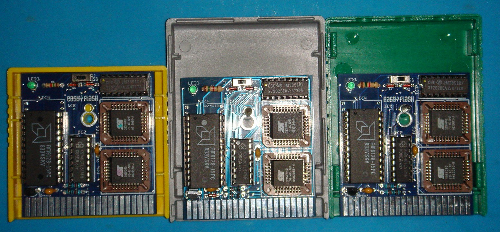
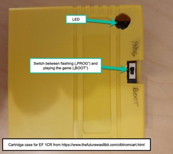
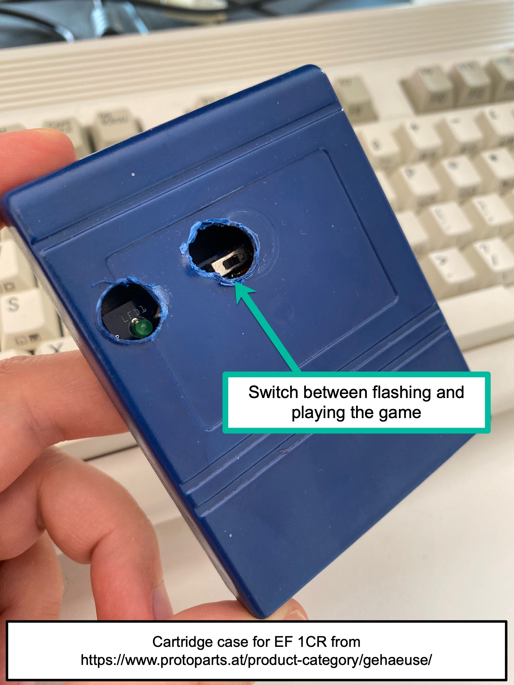

Cartridge Cases
===============

Some modern "homebrew" cartridges come as a raw PCB, without a plastic case.
**Never insert a raw PCB into your MEGA65's Expansion Port.** It is nearly
impossible to align all the pads and connections correctly so you might
damage the MEGA65 - or - in less drastic cases the cartridge will not work
reliably, but "only sometimes" and you will experience strange bugs.

Put your cartridges in cartride cases from
[The Future was 8BIT](https://www.thefuturewas8bit.com/c64romcart.html)
or from
[Protoparts](https://www.protoparts.at/product-category/gehaeuse/).

Flash Cartridges
================

First of all: Please support our friends at 
[Protovision](https://www.protovision.games)
and
[RGCD](https://rgcd.bigcartel.com/products)
and buy as many original hardware cartridges from them as you can and want
to afford. The Commodore 64 community needs to stay alive and therefore
publishers who are publishing to our beloved computer more than 40 years
after its release should be rewarded.

But there are many awesome
[game releases and other releases on csdb.dk](https://csdb.dk/browse.php?grouptype_id=0&profession_id=0&type=releases&releasetype_id=46&eventtype_id=0&bbstype_id=0&sidtype_id=0&browsesub=Browse%21)
that are not published on a hardware cartridge. And unfortunately more often
than not, your favorite cartridge is sold-out on
[Protovision](https://www.protovision.games)
and
[RGCD](https://rgcd.bigcartel.com/products).

So you might need another solution.

Why would you want to use real hardware Flash Cartridges on the MEGA65
while the MEGA65 can simulate cartridges using `*.crt` files that you can
store on and load from your SD card? The answer is, that a simulation is never
as perfect as real hardware: We use the MEGA65's HyperRAM to store the data
from the `*.crt` files when we simulate the cartridge. While this works very
well in more than 99% of the cases, the constraints of the HyperRAM (for
example its latency) can lead to undesired artefacts when playing simulated
cartridges: We actually need to halt the CPU for a short period of time, each
time the cartridge does a bank switch. Most of the time you won't notice, but
as said, there can be unintended consequences.

So for a 100% glitch-free retro experience, you might want to use real
hardware, i.e. real Flash Cartridges.

EasyFlash 1 and EasyFlash 1CR
-----------------------------

The original EasyFlash (aka EasyFlash 1) and the cost reduced
[EasyFlash 1CR](https://www.freepascal.org/~daniel/easyflash/)
are for sure among the most popular cartridges in the scene. Many new games
and other releases come in the EasyFlash cartridge format. Here is a
description about the EasyFlash taken from the
[original EasyFlash website](https://skoe.de/easyflash/):

"EasyFlash is a cartridge for the C64 expansion port. In contrast to
traditional cartridges, this one can be programmed directly from the C64.

You can easily create various classic computer game cartridges or program
collections with it. All what you need to do this is a C64, an EasyFlash,
the software available
[here](https://skoe.de/easyflash/downloads/)
and an image of the cartridge `*.crt`. As these `*.crt` files may be
quite large, a large capacity disk drive like the
FD-2000 or an
[SD2IEC](https://www.ncsystems.eu/)
device may be useful. For smaller drives EasySplit can be used to compress
and split large cartridge images."

Learn more about the EasyFlash on the
[C64 Wiki](https://www.c64-wiki.com/wiki/EasyFlash). 

Using the our C64 core, your MEGA65 is able to flash EasyFlash
cartridges. 

### EasyFlash 1CR

#### Buy the correct version

Since the original EasyFlash 1 is hard to find these days, we will
focus on the
[EasyFlash 1CR](https://www.freepascal.org/~daniel/easyflash/)
by Dani&euml;l Mantione. This handy cartridge is officially and proactively
supported by the C64 for MEGA65 core development team, so this is your number
one go to Flash Cartridge. Buy it
[here](https://www.freepascal.org/~daniel/easyflash/)
by filling out Dani&euml;l's form. Scroll down to the bottom of his web page
to find an order form. Here are some important considerations:

* Use the field where you specify your postal address to add the comment
  that you want a so called "Through Hole" version of the cartridge and
  **not** the so called "SMD" version of the cartridge. Only the
  "Through Hole" version is supported on the MEGA65 at this time. (This might
  change in future.)

* We highly recommend that you buy fully assembled cartridges to ensure
  that they actually work in your MEGA65.
  
* You need a case for the cartridge. The easiest way to obtain one is to
  order it from Dani&euml;l's website together with your Easy Flash 1CR.

The following image shows, how the "Through Hole" version of the EF 1CR
looks like and it shows different case variants that Dani&euml;l sells.
We recommend to order a
[The Future was 8BIT](https://www.thefuturewas8bit.com/c64romcart.html)
or
[Protoparts](https://www.protoparts.at/product-category/gehaeuse/).
case.

  
#### The basic idea and usage of the Easy Flash 1CR

As "CR" stands for "cost reduced", one of the basic idea of the Easy Flash
1CR is that it is affordable enough to be the Flash Cartrdige for all the
cartridge-based games that you really love: Flash once and enjoy forever.
Buy one cartridge per game. For avoiding misunderstanding: The EF 1CR
can be re-flashed as often as you like.

Conveniently, the Easy Flash 1CR comes with a preinstalled flasher: When you
insert the cartridge into your MEGA65's Expansion Port and
[start the machine and the cartridge correctly (!)](@TODO)
then you will see the EasyFlash program's start screen and you will
imediatelly be able to flash the `*.crt` file as
[described here](https://skoe.de/easyflash/writecrt/). If you don't have a
[SD2IEC](https://www.ncsystems.eu/)
or something similar, then you will likely need to split large `*.crt` files
into multiple `*.d64` images using
[EasySplit](http://skoe.de/easyflash/splitfiles/). Watch this
[YouTube video](https://youtu.be/jD-RmB6YzXc)
to learn how the flashing on the MEGA65 works when you have split the `*.crt`
files into multiple `*.d64` files.

#### Adjusting the case for being able to re-flash any time

After you flashed the EF 1CR for the first time, the built-in flasher is gone
and replaced by the game you flashed. If you want to re-flash at a later stage
you need to either use a screwdriver, open the case, move the switch to the
PROG position, close the case again, start the MEGA65 while the cartridge
is inserted, re-flash using
[preferably this version of EasyProg](https://github.com/MJoergen/C64MEGA65/raw/develop/doc/assets/easyprog-dm.prg),
open the cartridge case with a screwdriver again, move the switch back to the
BOOT position, close the case again and you are good to go. CAUTION: Do not
fall for the temptation to not use the plastic case! See above, very first
headline of this file.

As this is obviously a onerous workflow, we recommend that you cut or drill
some holes into the EF 1CR's case. Here are two examples from the MEGA65
team:

| Lydon's Example                  | sy2002's Example                  |
|----------------------------------|-----------------------------------|
|  |  |

[This version of EasyProg](https://github.com/MJoergen/C64MEGA65/raw/develop/doc/assets/easyprog-dm.prg)
is from the creator of the EF 1CR and is recommended for re-flashing the
EF 1CR. You can also use
[EasyProg 1.8.1 or newer](https://github.com/KimJorgensen/easyflash/releases).

EasyFlash 3
-----------

The EasyFlash 3 (EF3) is quite a beast: It sports seven 1 MB slots for game
and application cartridges. Each of these slots represents a full-featured EF1
cartridge. Additionally it can replace the internal Kernal with one of up to
eight Kernals saved in the cartridge. The EF3 can also run freezer cartridge
images such as Action Replay, Retro Replay, Nordic Power / Atomic Power and
Super Snapshot 5. Learn more
[here](http://skoe.de/easyflash/ef3intro/).

**IMPORTANT: The C64 for MEGA65 core is not yet supporting all features of the
EF3, so read the following information carefully.**

### How to use

1. Insert the EF3 into the Expansion Port and turn on your MEGA65. You will
   see the EF3's menu.

2. Press <kbd>K</kbd> while you are in the EF3's menu to kill the cartridge
   and go back to the C64's BASIC.

3. Return back to the EF3's menu any time by pressing the MEGA65's
   <kbd>Reset</kbd> button.

4. Flash up to seven 1 MB standard slots and up to two Freezer slots 
   using the built-in flasher (optionally also in conjunction with large IEC
   storage devices such as the
   [SD2IEC](https://www.ncsystems.eu/)).
   To do so, press <kbd>P</kbd> while you are in the EF3's start menu
   to start EasyProg. You can flash multiple slots (one after the other)
   while EasyProg is running. Make sure that you enter meaningful names for
   the slots when being prompted by EasyProg.

5. Play games by pressing a letter between <kbd>A</kbd> and <kbd>F</kbd> or
   start freezers by pressing <kbd>R</kbd>, <kbd>Y</kbd> or <kbd>S</kbd>.

Instead of using the keys mentioned above, you can also navigate the menu
using a joystick in port #2 or by using the cursor keys and <kbd>Return</kbd>.
Press <kbd>Space</kbd> to switch back and forth between the different pages
of the EF3's main menu.

### Using freezers

When you run a clean/unmodified EF3 for the first time, then the Action Replay
is in the slot that you can start with the <kbd>Y</kbd> from the EF3 menu.

The <kbd>Special</kbd> button of the EF3 works as the "freeze" button of the
selected freezer cartridge.

The following freezers are working. Download their binaries from
[rr.pokefinder.org](https://rr.pokefinder.org/) as these binaries are known
to work:

* [Action Replay](https://rr.pokefinder.org/wiki/Category:Action_Replay)
* [Nordic Power / Atomic Power](https://rr.pokefinder.org/wiki/Nordic_Power)
* [Super Snapshot 5](https://rr.pokefinder.org/wiki/Super_Snapshot)

The
[Retro Replay](https://rr.pokefinder.org/wiki/Retro_Replay)
is not working, yet.

Use the built in flasher that you can start with <kbd>P</kbd> from the EF3
menu to flash freezers. **Always make sure that you flash the `*.bin`
version of the freezer.**

### Known issue: The buttons do not work as expected

The EF3's <kbd>Reset</kbd> button does not work at all. The reason is that the
MEGA65's R3 and R3A board's electronic cannot sense the reset signal of any
cartridge inserted into the Expansion Port.

The <kbd>Menu</kbd> button does not work, yet for unknown reasons. But this
is not really a problem: Just press the MEGA65's <kbd>Reset</kbd> button to
return back to the EF3 menu.

The <kbd>Special</kbd> button works as intended as "freeze" button if you are
running a freezer cartridge. But it does not bring you back to BASIC ("Kill
the cartridge") when you pressed it while you are in the EF3 menu. Use the
key <kbd>K</kbd> instead to go back to BASIC.

### Known issue: Kernal mode is not supported

We are deliberately not supporting the Kernal mode of the EF3, because in
Kernal mode, the EF3 manipulates the address line A14, meaning it pulls at
this address line while the C64 core might simultaneously be doing the
opposite. The way how the MEGA65's hardware is built leads to a clash in such
a situation which might either harm the MEGA65 or the EF3.

For making sure that you're always on the safe side when using the EF3, we
deactivated the Kernal mode. You will notice that the border of your screen
is flickering if you try to enter the Kernal mode. This is the safe state,
nothing bad happens here. Just press <kbd>Reset</kbd> to try something else.

Kung Fu Flash
-------------

[Kung Fu Flash](https://github.com/KimJorgensen/KungFuFlash)
(KFF) can emulate different cartridge types, load PRG files and use
D64 disk images. Just place your desired CRT, PRG or D64 files on a FAT
formatted microSD card and use the built-in launcher to execute them.

Kung Fu Flash is a so called Software Defined Cartridge where a fast
microcontroller emulates cartridge hardware in software. This makes it
extremely flexible, allowing different cartridge types to be supported at a
relatively low cost. However, it can be challenging to get the C64 bus timing
correct in software and in some places the timing is very close to the limit.

You might sometimes experience glitches when running demanding software, so
in general it is fair to say the EF1 or the EF3 are more compatible with
the C64 for MEGA65.

But it is also important to mention that KFF induced glitches seem to be
very rare: We tested very demanding games with the KFF such as "Eye of the
Beholder", "A Pig Quest" and "Prince of Persia" and none of these games showed
any glitches.

### How to use

The circuits of the MEGA65's R3 and R3A boards are not able to detect the
KFF's signals properly. Therefore you need a workaround to work with the KFF.
It takes a bit of practice to get the timing right, but as soon as you are
getting the hang of it, you can work very well with the KFF and the C64 for
MEGA65 core:

**Always press the KFF's buttons in parallel with the MEGA65's
<kbd>Reset</kbd> button.**

1. To enter the KFF's menu, press <kbd>MEGA65 Reset</kbd> plus
   <kbd>KFF Menu</kbd>.

2. To start a game, press <kbd>MEGA65 Reset</kbd> plus <kbd>KFF Special</kbd>.

3. When you switch on your MEGA65 while the KFF is inserted into the Expansion
   Port, then the system initially crashes. Don't worry, this is "normal". Now
   decide whether you want to enter the menu, then perform step (1) or if
   you want to start the game, then perform step (2).

### Known issue: The buttons do not work as expected

The KFF's <kbd>Reset</kbd> button does not work at all. The reason is that the
MEGA65's R3 and R3A board's electronic cannot sense the reset signal of any
cartridge inserted into the Expansion Port.

The other two buttons <kbd>Special</kbd> and <kbd>Menu</kbd> work in the
context described above in "How to use" but they do otherwise not work
as intended.

### Known issue: Freezer cartridges are not working

Due to the <kbd>Special</kbd> button not working as expected, you cannot
activate the "freeze" menu of freezer cartridges.

Utility Cartridges that are known to work
=========================================

* Action Replay
* Epyx Fast Load
* Final Cartridge III
* GeoRAM
* PowerCartridge
* Super Snapshot

### Known issue: Reset button

The reset button does not work. The reason is that the MEGA65's R3 and R3A
board's electronic cannot sense the reset signal of any cartridge inserted
into the Expansion Port.

GeoRAM
------

GeoRAM works. Make sure that you use a GEOS boot disk with support for GeoRAM.
Here are two locations where you can download such boot disks:

* [commodore.software](https://commodore.software/downloads/download/690-geos-operating-system/11807-geos-2-0-georam-support)
* [www.lyonlabs.org](https://www.lyonlabs.org/commodore/onrequest/geos/index.html)
