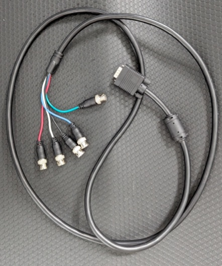
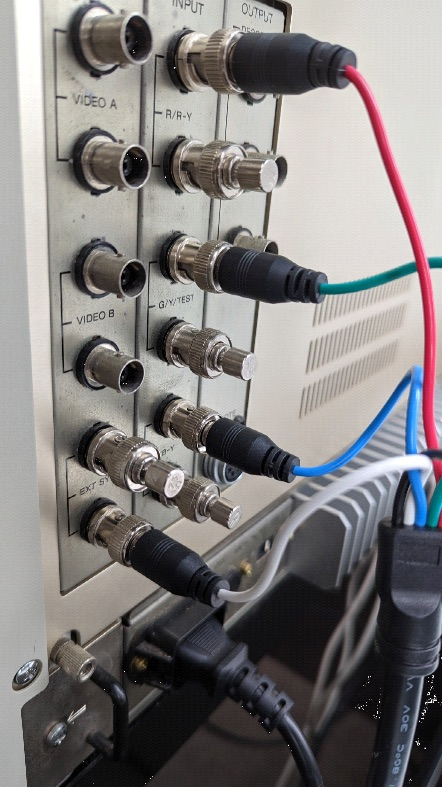
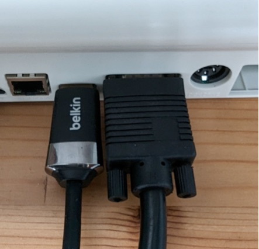
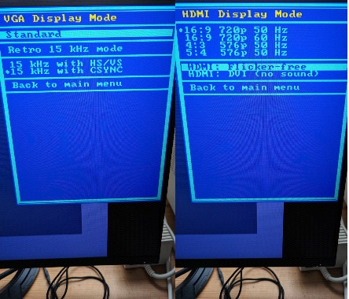
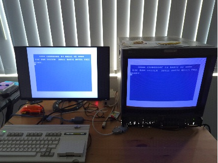
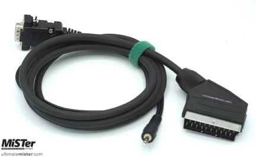

# Using Retro Cathode Ray Tubes

The C64 for MEGA65 core is capable of providing analog retro signals via the VGA port that have a 15 kHz horizontal frequency and that either
use a horizontal+vertical syncronization signal or a composite syncronization signal. The signal itself is a [component signal](https://en.wikipedia.org/wiki/Component_video#Component_versus_composite).

**IMPORTANT CAUTIONS:** (Not following these rules might destroy your retro device)

1. Only connect a retro device while having the 15 kHz retro VGA mode active. Never connect using the "Standard" mode which
   yields 30 kHz or more. High horizontal frequencies damage the cathode ray tube.
   
2. **Always use the right cable.** Particularly when you use SCART, the voltages need to be correct and therefore
   you need to [buy a cable with a built-in resistor](#scart)

3. When using retro gear via the MEGA65' VGA port: **Make sure that you disable HDMI: Flicker-free** otherwise you might run into a bunch of
problems. Learn more in the [user's manual](../README.md#important-advice-for-users-of-analog-vga-and-retro-15-khz-rgb-over-vga) and
in the [FAQ](../FAQ.md#7-my-retro-monitor-does-not-work-with-the-core).

## BNC

### VGA to BNC cable

To connect high-end or broadcast/production monitors with BNC connectors for RGB, you will require a VGA Plug to 5 BNC RGB Male Plugs Video Cable.
However, if you're using it for retro RGB video, connecting 4 plugs should suffice unless you're connecting to a projector or plasma TV that requires
separate horizontal and vertical syncing signals. The C64 core also supports this mode over 15kHz, making it a useful cable to have.

### Cable and connection details

To set up retro RGB, you'll need three RGB signals along with CSYNC. In the case of the C64 for MEGA65 core, the horizontal sync will be used as CSYNC.
For CSYNC, you can use the white lead, while the black lead can be left unconnected. Connect the R (Red), G (Green), and B (Blue) signals to their
respective analog inputs on the device or monitor. Take the CSYNC lead and connect it to the "external sync" input to the composite input panel.
By following these instructions, you will ensure the proper connection of the RGB signals and CSYNC for correct functionality. 

Connect the opposite end of the cable to the MEGA65's VGA port.

### Configuring the C64 for MEGA65 core

Look at the screenshot and choose the following options in VGA and HDMI display modes.
Turn off flicker-free and switch the standard mode to 15 Khz with CSYNC.

Important: Before turning on the monitor, make sure to switch from the Standard mode to the
Retro 15Khz mode + CSYNC. Providing the CRT with a 31kHz signal could potentially damage
your equipment. Exercise caution and ensure the correct setting is selected to avoid
damage to the monitor.

### Example setup

A second LCD monitor will be useful for making the necessary adjustments to the configuration.

## SCART and DB9 RGB

Connecting the MEGA65 running the C64 for MEGA65 core to retro tubes such as Commodore and Philips RGB monitors is more straight forward than on professional monitors.
Make sure you are configuring the C64 core as described above: **VGA: 15 kHz with CSYNC**.

### SCART

For connecting your MEGA65 to a Commodore 1084S or Philips CM8833 monitor with a SCART input you can use a MiSTer VGA to SCART cable like this one:

See here for where to purchase and availability and also make sure that you understand the importance of buying a cable that has a built-in
resistor versus simple "pass-through" cables: https://www.retrorgb.com/beware-of-mister-scart-cables.html

### DB9 RGB

For the later Commodore monitors such as the 1084S-P1 or Philips CM8833 Mark II, these have a DB9 RGB input as pictured below:

Use the following VGA to DB9 RGB cable which can be found [on eBay (example from Australia, adjust to your country)](https://www.ebay.com.au/itm/115728666823?mkcid=16&mkevt=1&mkrid=705-154756-20017-0&ssspo=VdRmcP3PRmW&sssrc=2047675&ssuid=_M7sYODUQqq&var=415792281593&widget_ver=artemis&media=COPY).
